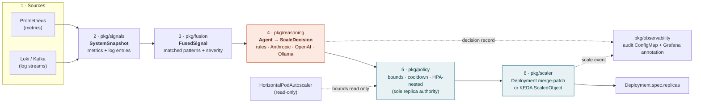

# Architecture

The operator is a six-stage pipeline: it reads the same signals an SRE reads
(metrics + logs), fuses them into one typed structure, routes that through a
pluggable reasoning step, clamps the result to a hard safety envelope, and only
then touches the cluster. Every decision is also written to an audit log and a
Grafana annotation so a human can read *why* it acted.

## Stages

| # | Package | Input | Output | Fails safe by |
|---|---------|-------|--------|---------------|
| 1 | (sources) | Prometheus HTTP API, Loki/Kafka | raw samples + log lines | signal error → back off and requeue, no decision |
| 2 | `pkg/signals` | CR `prometheusURL`, `logSource`, `metrics` overrides | `SystemSnapshot{Metrics, LogEntries}` | per-CR `$TARGET` PromQL; pure I/O, no cluster writes |
| 3 | `pkg/fusion` | `SystemSnapshot` + patterns | `FusedSignal{Snapshot, MatchedPatterns, SeverityScore, Recommendation}` | **zero Kubernetes deps**; invalid custom regex skipped, not fatal |
| 4 | `pkg/reasoning` | `FusedSignal` + bounds/counters | `ScaleDecision{Action, TargetReplicas, Reason, …}` | any provider error → rule-based agent → `hold`; never crashes |
| 5 | `pkg/policy` | `ScaleDecision`, CR spec, live HPA | clamped `ScaleDecision` | **sole authority over replicas**; clamps to bounds/cooldown/HPA envelope |
| 6 | `pkg/scaler` | clamped decision | `Deployment` merge-patch (or KEDA `ScaledObject`) | merge-patch on `spec.replicas` only; skipped entirely when `dryRun` |
| ⋯ | `pkg/observability` | decision + scale event | audit ConfigMap + Grafana annotation | **non-blocking**: a broken audit log or unreachable Grafana never fails a scale |

## The invariant that makes it safe to run

> Reasoning only *recommends*; `pkg/policy` is the only thing that decides a
> replica count. It clamps every decision to the CR bounds, the cooldown, and —
> in calibrated mode — the live HPA's envelope, which it reads but never writes.
> Dry-run is the default and no code path scales while it is on.

See `.claude/rules/hpa-coexistence.md` for the two coexistence modes and
[poster-figures.md](poster-figures.md) for the figure pack this diagram anchors.
