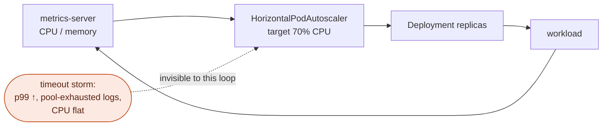
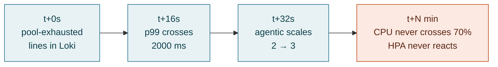
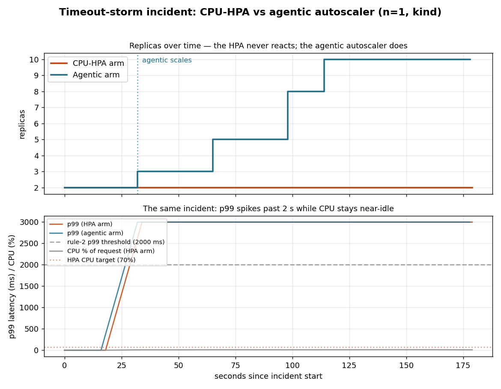
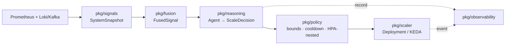
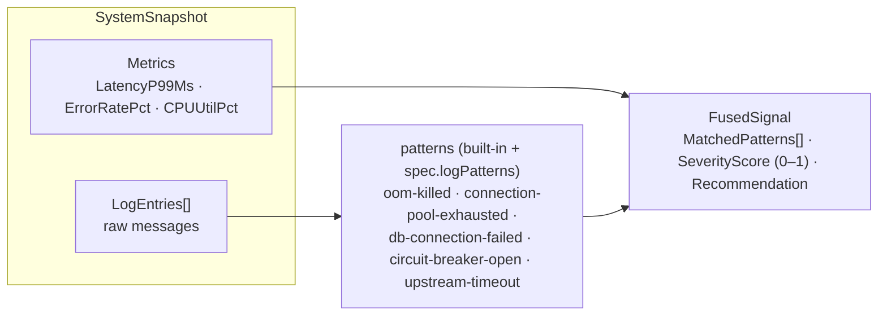
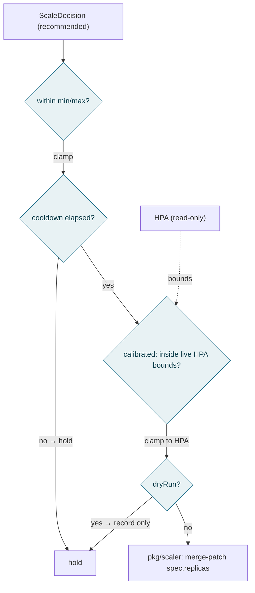
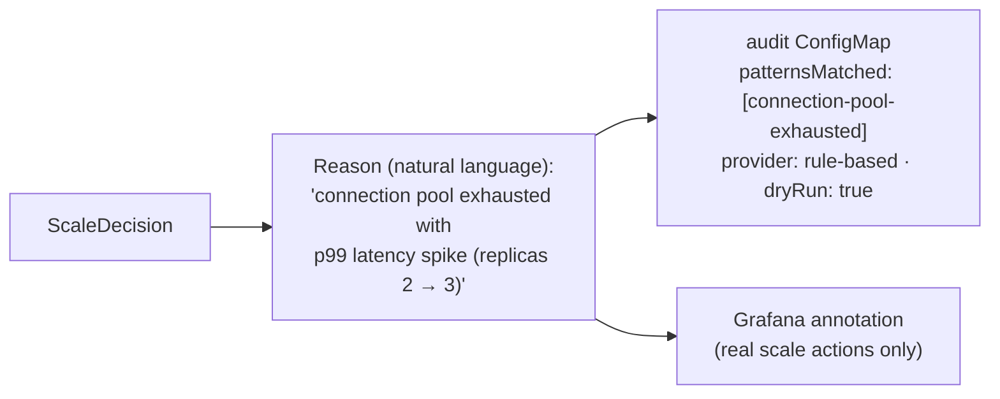
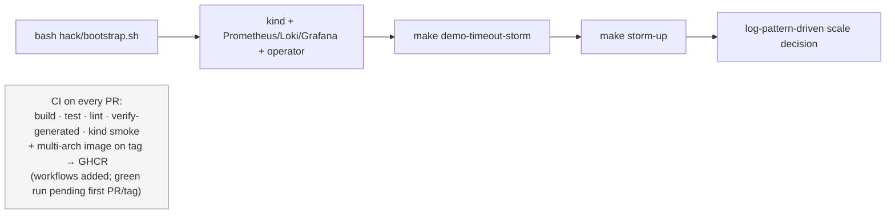

# Poster figure pack

The nine figures for the KubeCon poster, each built from this repo's real code
and runs and tagged with its **evidence level** — so nothing on the poster claims
more than the artifact backs. Same legend as the README maturity table:

- **Implemented** — code on the reconcile path · **Tested** — unit/envtest coverage
- **Observed** — seen end-to-end in a live `kind` run · **Roadmap** — not yet built/reachable

Lead the Results section with the **rule table (Tested)** and the **A/B lead-time
(Observed, n=1)**; present the consecutive-window gate as **restraint (Tested)**.

---

## Fig 1 — The problem: the HPA control loop `context`

HPA closes a loop on CPU/memory only. A latency/log incident is outside the loop.

---

## Fig 2 — Motivation: logs move before CPU `Observed (T5.1)`

In the A/B run the incident was fully visible in p99 and logs within ~15 s, while
CPU never left idle — so a CPU autoscaler has no signal to act on.

Grounded in `experiments/data/*.csv`. CPU peaked at ~13% of request all run.

---

## Fig 3 — HPA vs agentic, head-to-head `Observed (n=1)`

The single most persuasive figure: same incident, two autoscalers.

Source: `experiments/run.sh` + `experiments/analyze.py`. HPA stayed at 2 replicas;
the agentic autoscaler scaled 2→3→5→8→10, first action at 32 s. Single-run
demonstration on kind (**n=1**), not a benchmark — see `experiments/README.md`.

---

## Fig 4 — Architecture: six stages `Implemented · Tested`

The full pipeline and the safety/observability side-channels. Rendered in
[architecture.md](architecture.md); reproduced here for the poster.

---

## Fig 5 — Signal fusion as a typed structure `Implemented · Tested`

The contribution: multimodal signals collapse into one log-agnostic value the
reasoning step consumes. Real field names from `pkg/fusion/types.go`.

Tested in `pkg/fusion/*_test.go`; custom patterns via `spec.logPatterns` (T3.2).

---

## Fig 6 — Safety boundary: policy is the only authority `Implemented · Tested`

Reasoning recommends; policy decides. The agentic loop cannot violate the HPA
envelope, the CR bounds, the cooldown, or dry-run.

Enforced in `pkg/policy/enforcer.go` + `cooldown.go`; HPA access is `get/list/watch` only.

---

## Fig 7 — Results: the rule table + restraint `Tested + Observed`

The deterministic rule engine (always available, no LLM). Priority order; first
match wins. Verbatim from `pkg/reasoning/rules.go`.

| # | Trigger | Action | Confidence |
|---|---------|--------|-----------|
| 1 | `oom-killed` pattern | scale up 50% | 0.95 |
| 2 | `connection-pool-exhausted` AND p99 > 2000 ms AND window-gate | scale up 50% | 0.90 |
| 3 | error rate > 10% | scale up 30% | 0.80 |
| 4 | `circuit-breaker-open` AND window-gate | scale up 30% | 0.70 |
| 5 | severity 0 AND CPU < 20% AND quiet ≥ 15 min | scale down to min+1 | 0.60 |
| 6 | otherwise | hold | — |

**Restraint (Tested).** Rules 2 and 4 are gated on
`spec.detection.consecutiveWindows` (T3.1): a single transient window does **not**
scale — the pattern must persist across N windows first. With N=3 the agent holds
on windows 1–2 and acts on window 3, and the reason then reads
"…across 3 consecutive windows." Emergency OOM (rule 1) is never gated.

**A/B (Observed, n=1).** HPA never scaled; agentic scaled at 32 s (Fig 3).

---

## Fig 8 — Explainability: every decision has a reason `Implemented · Tested`

The output SREs read — a natural-language reason, an audit record, a Grafana
annotation. Strings below are the actual output from the T4.1 live run.

Recorded by `pkg/observability/configmap_recorder.go` + `grafana.go`.

---

## Fig 9 — Reproducibility: one command, no cloud account `Implemented`

Anyone can reproduce the case study on a laptop; CI gates every PR.

Bootstrap: `hack/bootstrap.sh`. Demo: `docs/demo-timeout-storm.md`. CI: `.github/workflows/ci.yml`, `release.yml`.

---

### Figure ↔ evidence summary

| Fig | Claim | Evidence level | Repo pointer |
|-----|-------|----------------|--------------|
| 1 | HPA reacts on CPU only | context | (baseline) |
| 2 | logs actionable before CPU | Observed (n=1) | `experiments/data/` |
| 3 | HPA vs agentic race | Observed (n=1) | `experiments/results/timeline.png` |
| 4 | six-stage architecture | Implemented · Tested | `docs/architecture.md`, `pkg/*` |
| 5 | typed signal fusion | Implemented · Tested | `pkg/fusion/` |
| 6 | policy safety boundary | Implemented · Tested | `pkg/policy/` |
| 7 | rule table + restraint | Tested (+ Observed A/B) | `pkg/reasoning/rules.go`, T3.1 tests |
| 8 | explainable decisions | Implemented · Tested | `pkg/observability/` |
| 9 | reproducibility + CI | Implemented (CI run pending) | `hack/bootstrap.sh`, `.github/workflows/` |
